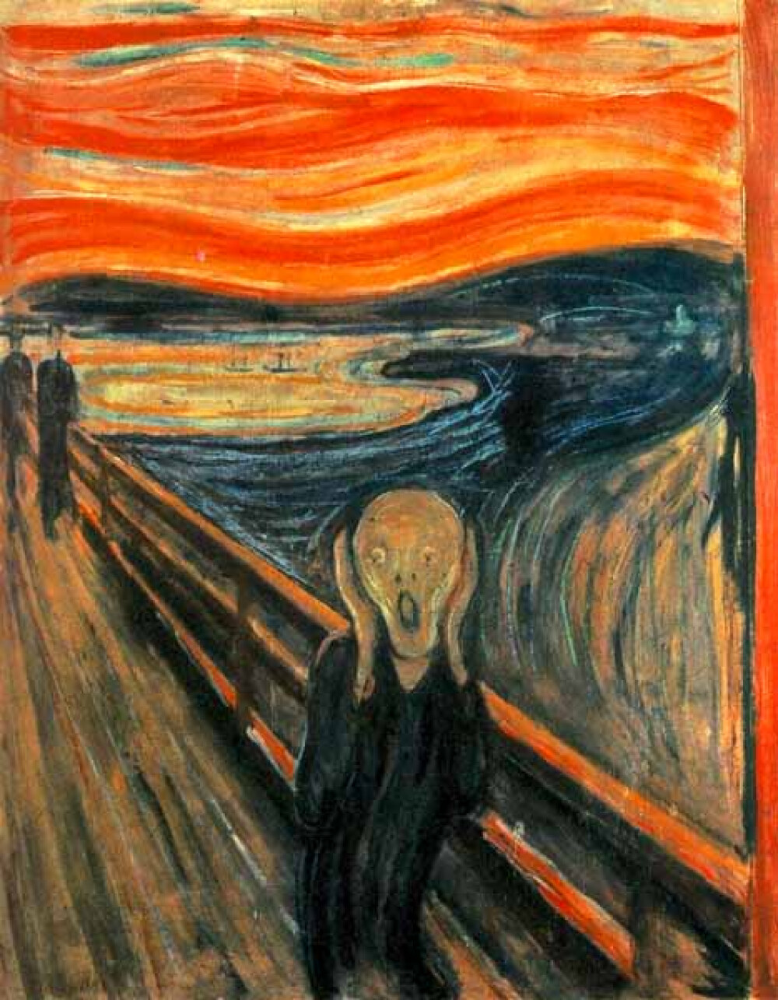

# fast_neural_style-TF

This is a Tensorflow implementation of the paper [**Perceptual Losses for Real-Time Style Transfer and Super-Resolution**]("https://cs.stanford.edu/people/jcjohns/eccv16/") by  [J. Johnson]("https://github.com/jcjohnson") et al. presented at ECCV 2016.

The paper [A Neural Algorithm of Artistic Style](http://arxiv.org/abs/1508.06576) by Gatys et al. hold the beginning of **Neural Style Transfer** based on pretrained deep CNNs, which can render the content image in the style of another one -- normally a painting has its own strokes and colors. However, Gatys' algorithm is expensive to run due to the optimization loop being carried. In this repository, we will implement J.Johnson's fast feed-forward style transfer network by Tensorflow, and utilize [Instance Normalization](https://arxiv.org/abs/1607.08022) method presented by Ulyanov et al. The network produces similar qualitative results but is three orders of magnitude faster than the optimization-based algorithm. 

<table>
	<tr>
		<th valign = 'bottom'><center> Content image </center></th>
		<th>
            <center></center>
            <center> Starry-night </center>
        </th>
	</tr>
	<tr>
		<td valign="middle">
			<center></center>
		</td>
        <td>
			<center></center>
		</td>
	</tr>
	<tr>
        <td>
            <center></center>
        </td>
        <td>
			<center></center>
		</td>
	</tr>
	<tr>
        <td>
            <center></center>
        </td>
        <td>
			<center></center>
		</td>
	</tr>
	<tr>
        <td>
            <center></center>
        </td>
        <td>
			<center></center>
		</td>
	</tr>
</table>


<table>
	<tr>
		<th valign = 'bottom'><center> Content image </center></th>
		<th>
            <center></center>
            <center> Scream </center>
        </th>
	</tr>
	<tr>
		<td valign="middle">
			<center></center>
		</td>
        <td>
			<center></center>
		</td>
	</tr>
	<tr>
        <td>
            <center></center>
        </td>
        <td>
			<center></center>
		</td>
	</tr>
	<tr>
        <td>
            <center></center>
        </td>
        <td>
			<center></center>
		</td>
	</tr>
	<tr>
        <td>
            <center></center>
        </td>
        <td>
			<center></center>
		</td>
	</tr>
</table>

### Dependency

- python 3.5 or 3.6
- tensoflow 
- VGG19 model weights download from the [TF-slim models](http://download.tensorflow.org/models/vgg_19_2016_08_28.tar.gz) 
- The code is tested on:
  - Ubuntu 16.04 LTS with CPU architecture x86_64 + Nvidia GeForce GTX 1080
  - Windows 10  + Nvidia GeForce GTX 1080

### Getting started 

Denote the directory of this repository as ```./fast_neural_style-TF/``` 

- #### Download the VGG19 pre-trained model

```bash
# clone the repository from github
git clone https://github.com/LiaoQian1996/multi_scale_deep_texture.git
cd $multi_scale_deep_texture/

# download the vgg19 model weights from 
# http://download.tensorflow.org/models/vgg_19_2016_08_28.tar.gz
# to multi_scale_deep_texture/vgg19/
```

- #### Stylize content image

  ```bash
      python main.py \
      --output_dir ./results/ \
      --content_dir ./contents/ \  # put content images in content_dir
      --mode inference \
      --pre_trained True \
      --checkpoint ./starry-night_in/model-40000 \
      --normalizer in \
      --vgg_ckpt ./vgg19/vgg_19.ckpt
  ```
  
  #### Train new style model
  
  ```bash
  #!/usr/bin/env bash
python main.py \
    --output_dir results/ \
    --content_dir DATA/COCO_train2014_1000/ \ # train data image, in .png or .jpg
    --style_dir ./styles/starry-night.jpg \
    --mode train \
    --pre_trained False \
    --normalizer bn \  # bn or in
    --batch_size 4 \
    --crop_size 256 \
    --lr 0.001 \
    --max_iter 40000 \
    --decay_step 20000 \
    --decay_rate 0.1 \
    --save_freq 1000 \
    --display_freq 50 \
    --summary_freq 100 
  ```

  


